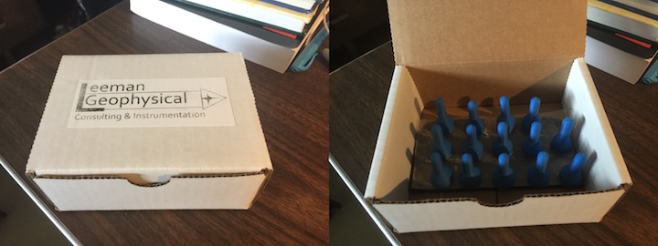

# Magnetic Control Stick

Magnet holder for controlling electronic devices. Designed for the
GeoPebble project at Penn State by John R. Leeman. Current design utilizes
0.5" x 0.125" rare earth magnets.

* We recommend super-glue or equivalent to ensure magnets stay in
the holders in all conditions.
* We have noticed that any extra gap in the space between the
bottom of the stick and the magnet surface can significantly decrease
performance. You can sand away extra plastic material after gluing magnets in
or reduce the gap in the OpenSCAD file.
* Printed on Taz4 by Lulzbot with no raft, skirt, or brim. Medium or fast
speed with ABS plastic. 40% infill.
